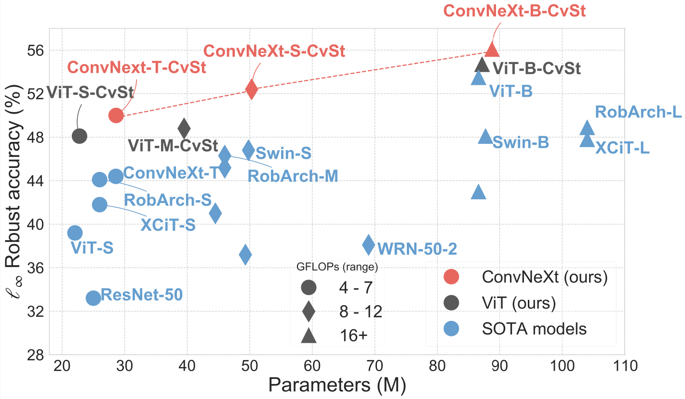

# Revisiting Adversarial Training for ImageNet: Architectures, Training and Generalization across Threat Models
#### Naman D Singh, Francesco Croce, Matthias Hein 
#### University of Tübingen
### Paper : https://arxiv.org/pdf/2303.01870.pdf
## Abstract
While adversarial training has been extensively studied for ResNet architectures and low resolution datasets like CIFAR, much less is known for ImageNet. Given the recent debate about whether transformers are more robust than convnets, we revisit adversarial training on ImageNet comparing ViTs and ConvNeXts. Extensive experiments show that minor changes in architecture, most notably replacing PatchStem with ConvStem, and training scheme have a significant impact on the achieved robustness. These changes not only increase robustness in the seen $\ell_\infty$-threat model, but even more so improve generalization to unseen $\ell_1/\ell_2$-robustness.

## Code
Requirements (specific versions tested on):  
`fastargs-1.2.0` `autoattack-0.1` `pytorch-1.13.1` `torchvision-0.14.1` `robustbench-1.1` `timm-0.8.0.dev0`, `GPUtil`

#### Training
The bash script in `run_train.sh` trains the model `model.arch`. For clean training: `adv.attack none` and for adversarial training set `adv.attack apgd`. 
For the standard setting as in the paper (heavy augmentations) set `data.augmentations 1`, `model.model_ema 1` and `training.label_smoothing 1`. 
To train models with Convolution-Stem (CvSt) set `model.not_original 1`. 
The code does standard APGD adversarial training.  The file `utils_architecture.py` has model definitions for the new `CvSt` models, all models are built on top of timm imports.

#### Evaluating a model
The file `runner_aa_eval` runs `AutoAttack`(AA). Passing `fullaa 1` runs complete AA whereas `fullaa 0` runs the first two attacks (APGD-CE and APGD-T) in AA. 

#### Checkpoints - ImageNet $\ell_{\infty} = 4/255$ robust models.
The link location includes weights for the clean model (the one used as initialization for Adversarial Training (AT)), the robust model, and the `full-AA` log for $\ell_{\infty}, \ell_2$ and $\ell_1$ attacks.  
Note: the higher resolution numbers use the same checkpoint as for the standard resolution of 224 - only evlautaion is done at the higher resolution mentioned. 
| Model-Name           | epochs | res. | Clean acc. | AA - $\ell_{\infty}$ acc.|  Checkpoint (Link) |
| :---                 | :------: | :------: | :------:   |:------: | :------:    |   
| ConvNext-iso-CvSt    | 300 | 224 | 70.2  | 45.9 |   [Link](https://nc.mlcloud.uni-tuebingen.de/index.php/s/HpNbkLTNTBiaeo8)|
| ViT-S-CvSt           | 300 | 224 | 72.5  | 48.1 |   [Link](https://nc.mlcloud.uni-tuebingen.de/index.php/s/agtDw3D7QXbDCmw)|
| ConvNext-T-CvSt      | 300 | 224 | 72.7  | 49.5 |   [Link](https://nc.mlcloud.uni-tuebingen.de/index.php/s/BFLoMrMdn8iBk7Y)|
| ViT-M-CvSt           | 50 | 224 | 72.4   | 48.8 |   [Link](https://nc.mlcloud.uni-tuebingen.de/index.php/s/q2mkEYtq5Zjpa4e)|
| ConvNext-S-CvSt      | 50 | 224 | 74.4   | 52.4 |   [Link](https://nc.mlcloud.uni-tuebingen.de/index.php/s/m3bAwNg4CJY4jrp)|
| ViT-B-CvSt           | 250 | 224 | 76.3  | 54.7 |   [Link](https://nc.mlcloud.uni-tuebingen.de/index.php/s/SbN5AJAicdZJXyr)|
| ConvNext-B-CvSt      | 250 | 224 | 75.9  | 56.1 |   [Link](https://nc.mlcloud.uni-tuebingen.de/index.php/s/RQBEXagC7R7XweX)|
| ConvNext-B-CvSt      | --- | 256 | 76.9  | 57.3 |   [Link](https://nc.mlcloud.uni-tuebingen.de/index.php/s/RQBEXagC7R7XweX)|
| ConvNext-L-CvSt      | 100 | 224 | 77.0  | 57.7 |   [Link](https://nc.mlcloud.uni-tuebingen.de/index.php/s/LeYdmW9DMAr8zws)|

###### Checkpoints for ImageNet models finetuned to be robust at $\ell_{\infty} = 8/255$ can be found here: [Link](https://nc.mlcloud.uni-tuebingen.de/index.php/s/FiTToeo4RKY896P)
